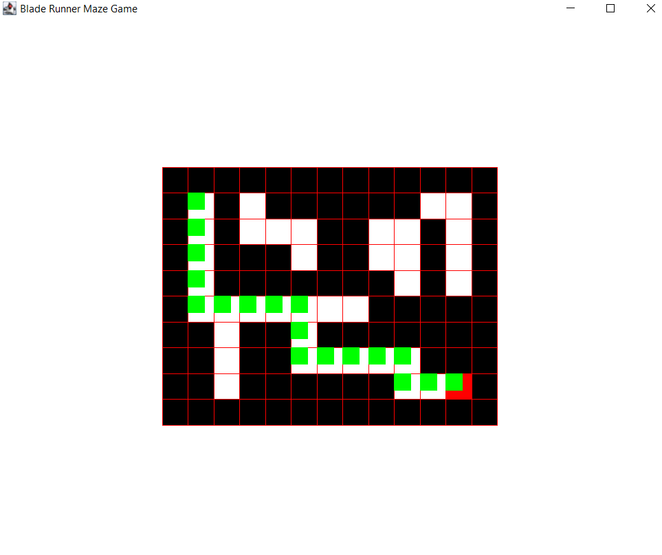

# Maze Solver Project

This project is a Java-based maze solver that uses the Depth First Search algorithm to find the shortest path to the destination.
The maze solver is built using Java, Java Swing, and AWT technologies.

## Getting Started
To use the maze solver, simply clone or download the repository to your local machine. The project is organized into packages, 
each representing a different component of the maze solver.

## Usage
To run the maze solver, simply navigate to the src directory and run the MazeSolver.java file. This will launch the user interface for the maze solver.
To use the maze solver, select a maze file and click the "Solve" button. The maze solver will use the <strong>Depth First Search Algorithm</strong> to find the 
<strong>shortest path to the destination</strong>. The path will be displayed on the maze, and the length of the path will be displayed in the user interface.

## Output Screen

## Contributing
Contributions to this repository are welcome! If you would like to contribute, please create a pull request and explain your changes. 
All contributions should include tests and adhere to the Google Java Style Guide.

